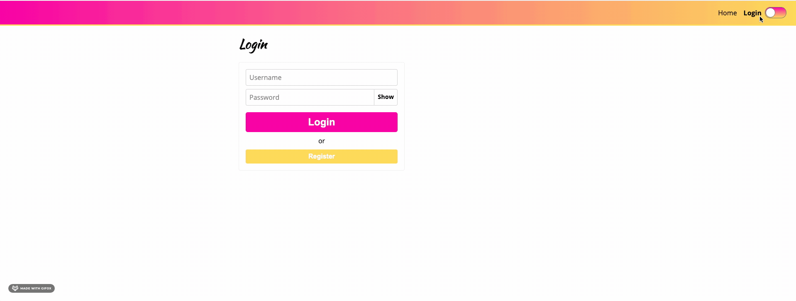

# Styled-Components Practice

App with a home page, login page with login form and loading spinner animation as well as a light/dark theme switcher. This project was created in the React styled-components v5 (2021 edition) course on Udemy as a way of learning to use styled-components in my future React projects.

Live Link: ()

## Screenshot

## Technologies

- styled-components
- React and React Router
